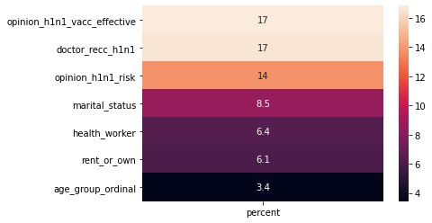

### Lessons from the H1N1 Pandemic
A machine learning model by Jade Adams and Stephen William, students at the Flatiron School.
 
 
### Business Problem
 
The Center for Disease Control and Prevention seeks to combat vaccine hesistancy in the United States. It has hired us to investigate a comprehensive dataset from our last major national pandemic, the H1N1 virus, and find a model and correlation characteristics with getting vaccinated or not. It will use this model to hone resources in on areas and populations of the United States with a high likelihood for vaccine hesistancy
 
 
### Dataset Characteristics
 
The dataset consists of 26,000 respondents demographic information, opinions on the H1N1 pandemic and vaccine, and their decision to get vaccinated or not. There is in total 40 rows of information per respondent, including marital status, sex,race, income, occupation, health care coverage, and more. Opinion characteristics were all ordinal: they answered questions with a scale of 1-5.
 
A Pandas printout of our data:
 

 
Of the 26,000 respondents, 21% of them received the H1N1 vaccine.
 

 
### Model
 
Using the dataset, we built a logistic regression pipeline that could predict with 75% accuracy whether someone wass vaccinated or not depending on their characteristics. We found the best logistic regression pipeline using a grid search. In total, we tested over 10 different models before finding the best one.
 
Below is a confusion matrix of our final model, demonstrating the percentage-wise accuracy of the model. 
 
 

 
 ### Key Takeaways

 
1. Their doctor reccomended them the vaccine
2. Their level of concern about the pandemic was high
3. Their belief in the efficacy of the vaccine was high

Below is the percentage-wise effect of the highest-correlated categories on the prediction model.

### Reccomendations
 
It is important then for the CDC to improve doctor outreach and regulations to make sure primary care physicians are encouraging their patients to get the COVID-19 vaccine, as this was singlehandedly the most important determiner of whether someone was vaccinated or not.
 
Additionally, using our model, the CDC can determine populations with high likelihood of not getting vaccinated. There are high correlations between income,education, and race for vaccination, so our model can assist in finding where education resources can be best used to boost vaccination rate.

Lastly, the CDC should invest in future surveying to understand the factors behind U.S. residents' concern about the COVID-19 pandemic and the vaccine effectiveness, as these were the most highly correlated factors to getting vaccinated besides a doctor reccomendation.

## Contributors:

Jade Adams
Stephen Williams

## Data Source

https://www.drivendata.org/competitions/66/flu-shot-learning/
